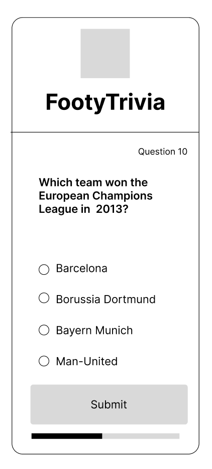
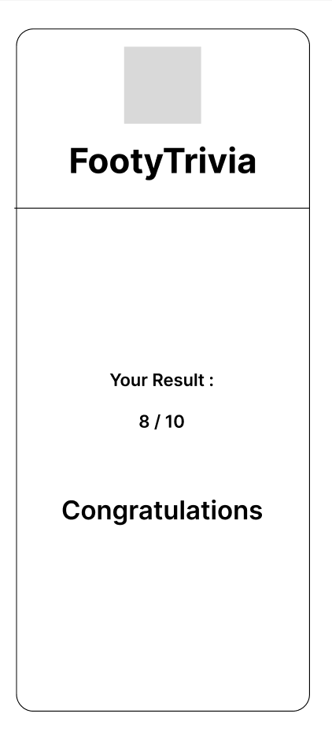
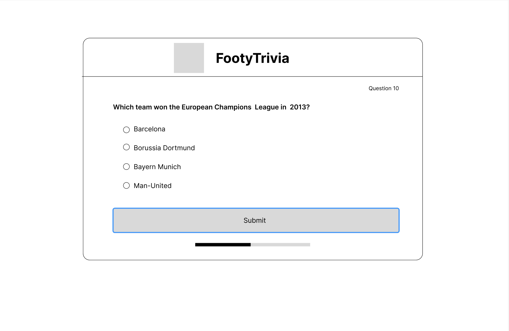
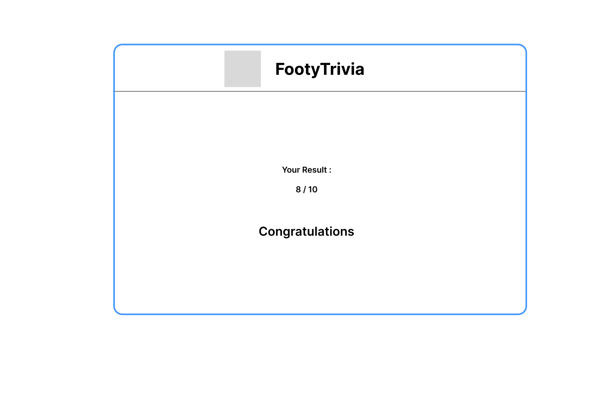
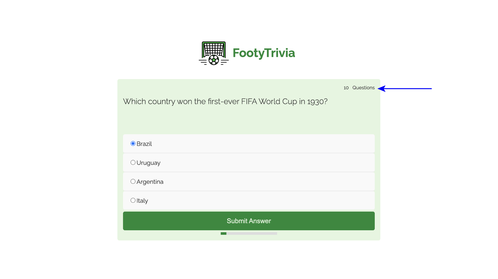
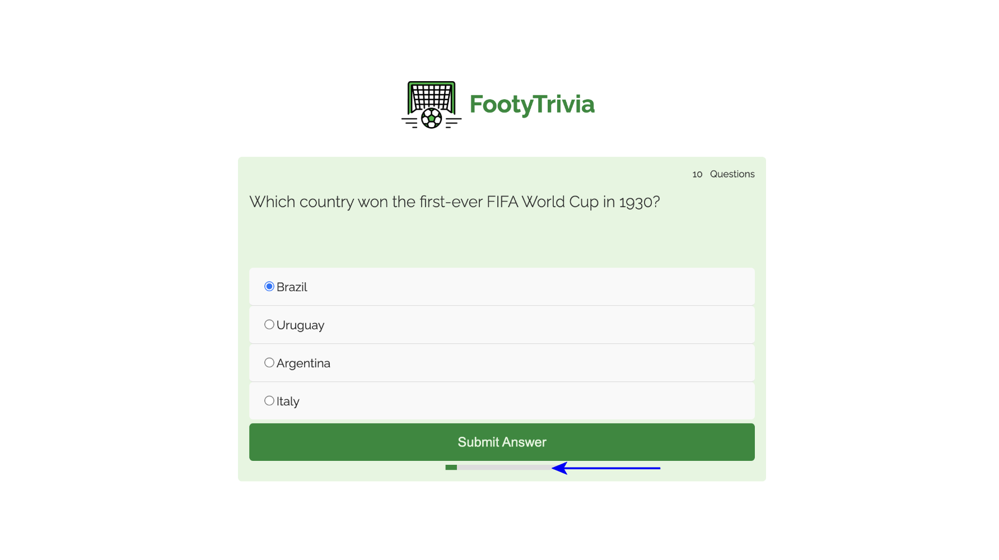
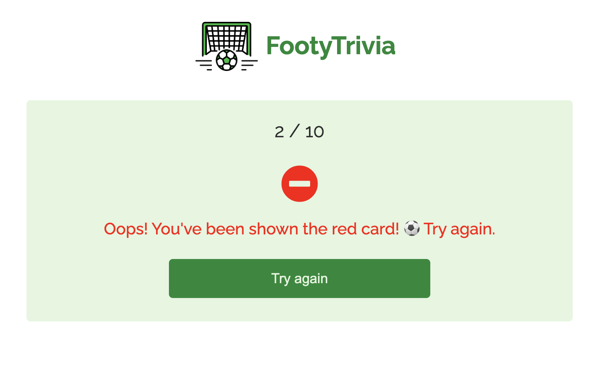
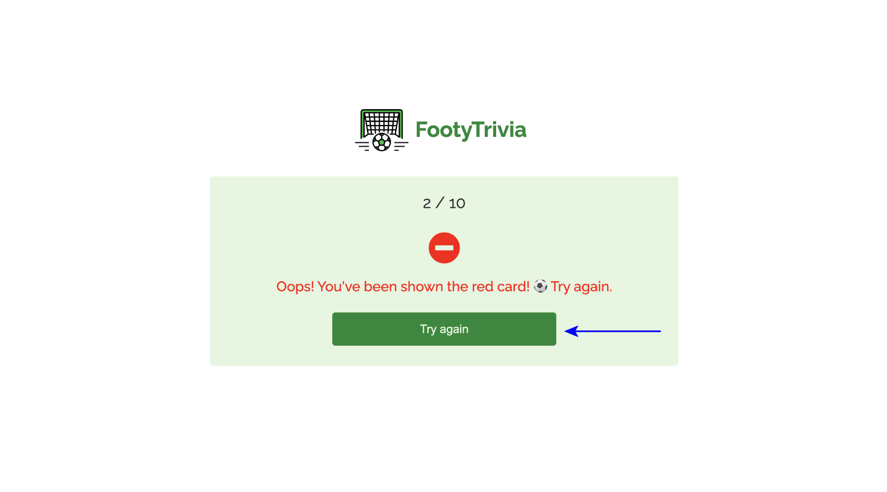

# [FOOTYTRIVIA CHALLENGE](https://ibra8080.github.io/FootyTrivia-Challenge)

FootyTrivia is an engaging and educational quiz game designed to test and expand users' knowledge of football (soccer). The game features a variety of questions about football clubs, players, historical matches, achievements, and other interesting trivia. FootyTrivia aims to provide an entertaining way for football enthusiasts to challenge themselves and learn more about the sport they love.

# Objectives
- Educate: Provide users with interesting and informative trivia about football.
- Entertain: Create an enjoyable and challenging game experience.
- Engage: Foster a sense of community and competition among football fans.
- Inspire: Encourage users to delve deeper into football history and facts.

source: [amiresponsive](https://ui.dev/amiresponsive?url=https://ibra8080.github.io/FootyTrivia-Challenge)

## UX

### Colour Scheme

- `#138935` used for primary items (logo, Buttons).
- `#2d2d2d` used for text.
- `#e4f6df` used for background.
- `#ececec` used for secondary background.
- `##FF0000` used for losing massage.

I used [coolors.co](https://coolors.co/e84610-009fe3-4a4a4f-445261-d63649-e6ecf0-000000) to generate my colour palette.

### Typography

- [Raleway](https://fonts.google.com/specimen/Raleway) was used for all text.

- [Font Awesome](https://fontawesome.com) icons were used in the ending messages.

## Wireframes

To follow best practice, wireframes were developed for mobile, tablet, and desktop sizes.
I've used [Balsamiq](https://balsamiq.com/wireframes) to design my site wireframes.

### Mobile Wireframes

 Click here to see the Mobile Wireframes 

Quiz
  - 

Result
  - 

### Large screens Wireframes

 Click here to see the Largescreens Wireframes 

Quiz
  - 

Result
  - 

## Features

### Existing Features

- **Dynamic Question Count Display-#1**

    - FootyTrivia includes a dynamic area that displays the total number of questions in the quiz. This feature helps users know how many questions they have to answer, giving them a clear understanding of the quiz's scope.

- **Progress Bar-#2**

    - To provide a visual representation of how much of the quiz has been completed, FootyTrivia features a progress bar. As users answer questions, the progress bar updates to reflect their advancement, offering a clear and engaging way to see their journey through the quiz.

- **Humorous Result Messages-#3**

    - At the end of the quiz, users receive a funny message based on their performance. Whether they win or lose, these messages are designed to add an extra layer of enjoyment and encouragement, along with displaying their final score.

- **Try Again Button-#4**

    - For users who don't succeed on their first attempt, FootyTrivia offers a "Try Again" button. This feature allows users to easily reload the quiz and have another go, promoting continuous engagement and learning.

- **Responsive Design-#5**

    - DFootyTrivia is built with a responsive design, ensuring that the game looks and functions beautifully on all screen sizes. Whether users are playing on a desktop, tablet, or smartphone, they will enjoy a seamless and intuitive experience.

### Future Features

- Ability to Choose Question Categories-#1
    - FootyTrivia will allow users to select specific categories of questions based on their interests. Whether it's focusing on a particular league, team, or era, users will have the flexibility to tailor the quiz to their preferences, enhancing their engagement and enjoyment.
- Difficulty Level Selection-#2
    - To cater to both beginners and seasoned football enthusiasts, FootyTrivia will introduce the option to choose the difficulty level of the questions. Users can select from easy, medium, and hard levels, ensuring a personalized and appropriately challenging experience.
- Leaderboard Integration-#3
    - FootyTrivia plans to integrate a leaderboard feature, enabling users to compete with friends and other players around the world. This addition will foster a sense of community and competition, encouraging users to improve their scores and knowledge.
- Social Sharing Options-#4
    - FootyTrivia will offer social sharing options, enabling users to share their scores and achievements on social media platforms. This feature will encourage friendly competition and increase the game's visibility among potential new players.

## Tools & Technologies Used

-  used to generate README and TESTING templates.
-  used for version control. (`git add`, `git commit`, `git push`)
-  used for secure online code storage.
-  used as a cloud-based IDE for development.
-  used for the main site content.
-  used for the main site design and layout.
-  used for user interaction on the site.
-  used for hosting the deployed front-end site.
-  used for creating wireframes.
-  used for the icons.
-  used to help debug, troubleshoot, and explain things.

## Testing

> [!NOTE]  
> For all testing, please refer to the [TESTING.md](TESTING.md) file.

## Deployment

The site was deployed to GitHub Pages. The steps to deploy are as follows:

- In the [GitHub repository](https://github.com/ibra8080/FootyTrivia-Challenge), navigate to the Settings tab 
- From the source section drop-down menu, select the **Main** Branch, then click "Save".
- The page will be automatically refreshed with a detailed ribbon display to indicate the successful deployment.

The live link can be found [here](https://ibra8080.github.io/FootyTrivia-Challenge)

### Local Deployment

This project can be cloned or forked in order to make a local copy on your own system.

#### Cloning

You can clone the repository by following these steps:

1. Go to the [GitHub repository](https://github.com/ibra8080/FootyTrivia-Challenge) 
2. Locate the Code button above the list of files and click it 
3. Select if you prefer to clone using HTTPS, SSH, or GitHub CLI and click the copy button to copy the URL to your clipboard
4. Open Git Bash or Terminal
5. Change the current working directory to the one where you want the cloned directory
6. In your IDE Terminal, type the following command to clone my repository:
	- `git clone https://github.com/ibra8080/FootyTrivia-Challenge.git`
7. Press Enter to create your local clone.

Alternatively, if using Gitpod, you can click below to create your own workspace using this repository.

Please note that in order to directly open the project in Gitpod, you need to have the browser extension installed.
A tutorial on how to do that can be found [here](https://www.gitpod.io/docs/configure/user-settings/browser-extension).

#### Forking

By forking the GitHub Repository, we make a copy of the original repository on our GitHub account to view and/or make changes without affecting the original owner's repository.
You can fork this repository by using the following steps:

1. Log in to GitHub and locate the [GitHub Repository](https://github.com/ibra8080/FootyTrivia-Challenge)
2. At the top of the Repository (not top of page) just above the "Settings" Button on the menu, locate the "Fork" Button.
3. Once clicked, you should now have a copy of the original repository in your own GitHub account!

### Local VS Deployment

🛑🛑🛑🛑🛑🛑🛑🛑🛑🛑-START OF NOTES (to be deleted)

Use this space to discuss any differences between the local version you've developed, and the live deployment site on GitHub Pages.

🛑🛑🛑🛑🛑🛑🛑🛑🛑🛑-END OF NOTES (to be deleted)

## Credits

🛑🛑🛑🛑🛑🛑🛑🛑🛑🛑-START OF NOTES (to be deleted)

In this section you need to reference where you got your content, media, and extra help from.
It is common practice to use code from other repositories and tutorials,
however, it is important to be very specific about these sources to avoid plagiarism.

🛑🛑🛑🛑🛑🛑🛑🛑🛑🛑-END OF NOTES (to be deleted)

### Content

🛑🛑🛑🛑🛑🛑🛑🛑🛑🛑-START OF NOTES (to be deleted)

Use this space to provide attribution links to any borrowed code snippets, elements, or resources.
A few examples have been provided below to give you some ideas.

Ideally, you should provide an actual link to every resource used, not just a generic link to the main site!

⚠️⚠️ EXAMPLE LINKS - REPLACE WITH YOUR OWN ⚠️⚠️

🛑🛑🛑🛑🛑🛑🛑🛑🛑🛑-END OF NOTES (to be deleted)

| Source | Location | Notes |
| --- | --- | --- |
| [Markdown Builder](https://tim.2bn.dev/markdown-builder) | README and TESTING | tool to help generate the Markdown files |
| [Chris Beams](https://chris.beams.io/posts/git-commit) | version control | "How to Write a Git Commit Message" |
| [W3Schools](https://www.w3schools.com/howto/howto_js_topnav_responsive.asp) | entire site | responsive HTML/CSS/JS navbar |
| [W3Schools](https://www.w3schools.com/howto/howto_css_modals.asp) | contact page | interactive pop-up (modal) |
| [W3Schools](https://www.w3schools.com/css/css3_variables.asp) | entire site | how to use CSS :root variables |
| [Flexbox Froggy](https://flexboxfroggy.com/) | entire site | modern responsive layouts |
| [Grid Garden](https://cssgridgarden.com) | entire site | modern responsive layouts |
| [StackOverflow](https://stackoverflow.com/a/2450976) | quiz page | Fisher-Yates/Knuth shuffle in JS |
| [YouTube](https://www.youtube.com/watch?v=YL1F4dCUlLc) | leaderboard | using `localStorage()` in JS for high scores |
| [YouTube](https://www.youtube.com/watch?v=u51Zjlnui4Y) | PP3 terminal | tutorial for adding color to the Python terminal |
| [strftime](https://strftime.org) | CRUD functionality | helpful tool to format date/time from string |
| [WhiteNoise](http://whitenoise.evans.io) | entire site | hosting static files on Heroku temporarily |

### Media

🛑🛑🛑🛑🛑🛑🛑🛑🛑🛑-START OF NOTES (to be deleted)

Use this space to provide attribution links to any images, videos, or audio files borrowed from online.
A few examples have been provided below to give you some ideas.

If you're the owner (or a close acquaintance) of all media files, then make sure to specify this.
Let the assessors know that you have explicit rights to use the media files within your project.

Ideally, you should provide an actual link to every media file used, not just a generic link to the main site!
The list below is by no means exhaustive. Within the Code Institute Slack community, you can find more "free media" links
by sending yourself the following command: `!freemedia`.

⚠️⚠️ EXAMPLE LINKS - REPLACE WITH YOUR OWN ⚠️⚠️

🛑🛑🛑🛑🛑🛑🛑🛑🛑🛑-END OF NOTES (to be deleted)

| Source | Location | Type | Notes |
| --- | --- | --- | --- |
| [Pexels](https://www.pexels.com) | entire site | image | favicon on all pages |
| [Lorem Picsum](https://picsum.photos) | home page | image | hero image background |
| [Unsplash](https://unsplash.com) | product page | image | sample of fake products |
| [Pixabay](https://pixabay.com) | gallery page | image | group of photos for gallery |
| [Wallhere](https://wallhere.com) | footer | image | background wallpaper image in the footer |
| [This Person Does Not Exist](https://thispersondoesnotexist.com) | testimonials | image | headshots of fake testimonial images |
| [Audio Micro](https://www.audiomicro.com/free-sound-effects) | game page | audio | free audio files to generate the game sounds |
| [Videvo](https://www.videvo.net/) | home page | video | background video on the hero section |
| [TinyPNG](https://tinypng.com) | entire site | image | tool for image compression |

### Acknowledgements

🛑🛑🛑🛑🛑🛑🛑🛑🛑🛑-START OF NOTES (to be deleted)

Use this space to provide attribution to any supports that helped, encouraged, or supported you throughout the development stages of this project.
A few examples have been provided below to give you some ideas.

⚠️⚠️ EXAMPLES ONLY - REPLACE WITH YOUR OWN ⚠️⚠️

🛑🛑🛑🛑🛑🛑🛑🛑🛑🛑-END OF NOTES (to be deleted)

- I would like to thank my Code Institute mentor, [Tim Nelson](https://github.com/TravelTimN) for his support throughout the development of this project.
- I would like to thank the [Code Institute](https://codeinstitute.net) tutor team for their assistance with troubleshooting and debugging some project issues.
- I would like to thank the [Code Institute Slack community](https://code-institute-room.slack.com) for the moral support; it kept me going during periods of self doubt and imposter syndrome.
- I would like to thank my partner (John/Jane), for believing in me, and allowing me to make this transition into software development.
- I would like to thank my employer, for supporting me in my career development change towards becoming a software developer.
