# Testing

> [!NOTE]  
> Return back to the [README.md](README.md) file.

## Code Validation

### HTML

I have used the recommended [HTML W3C Validator](https://validator.w3.org) to validate all of my HTML files.

| Directory | File | Screenshot | Notes |
| --- | --- | --- | --- |
|  | index.html | 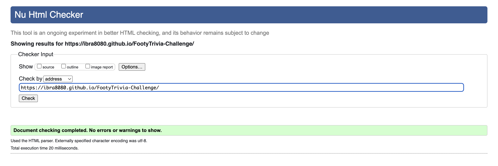 | |

### CSS

I have used the recommended [CSS Jigsaw Validator](https://jigsaw.w3.org/css-validator) to validate all of my CSS files.

| Directory | File | Screenshot | Notes |
| --- | --- | --- | --- |
| assets | style.css | 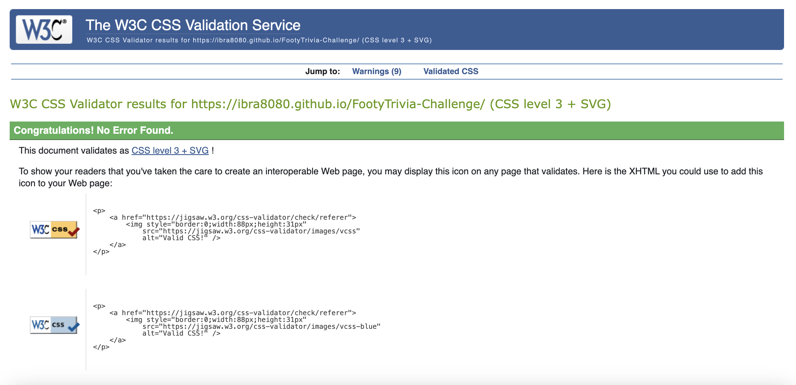 | |

### JavaScript

I have used the recommended [JShint Validator](https://jshint.com) to validate all of my JS files.

| Directory | File | Screenshot | Notes |
| --- | --- | --- | --- |
| assets | questions.js | 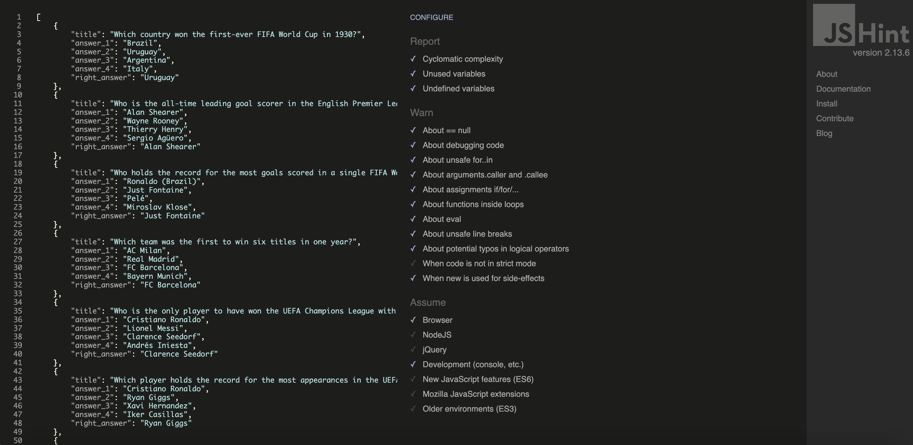 | |
| assets | script.js | 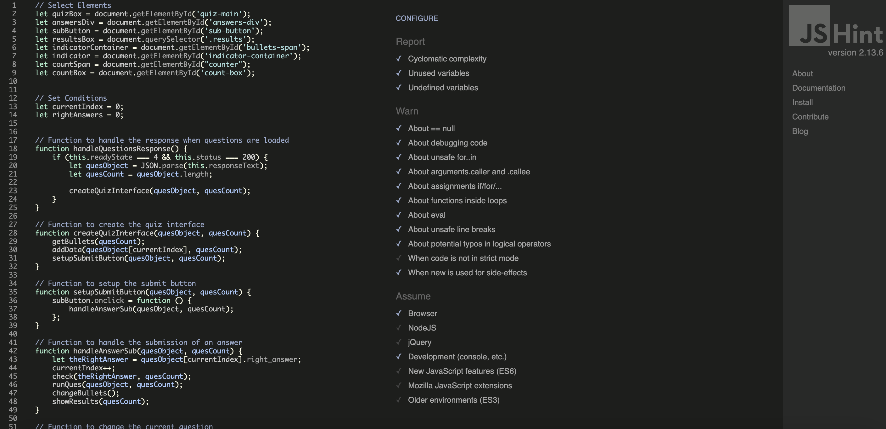 | |

## Browser Compatibility

I've tested my deployed project on multiple browsers to check for compatibility issues.

| Browser | Home | Notes |
| --- | --- | --- |
| Chrome | 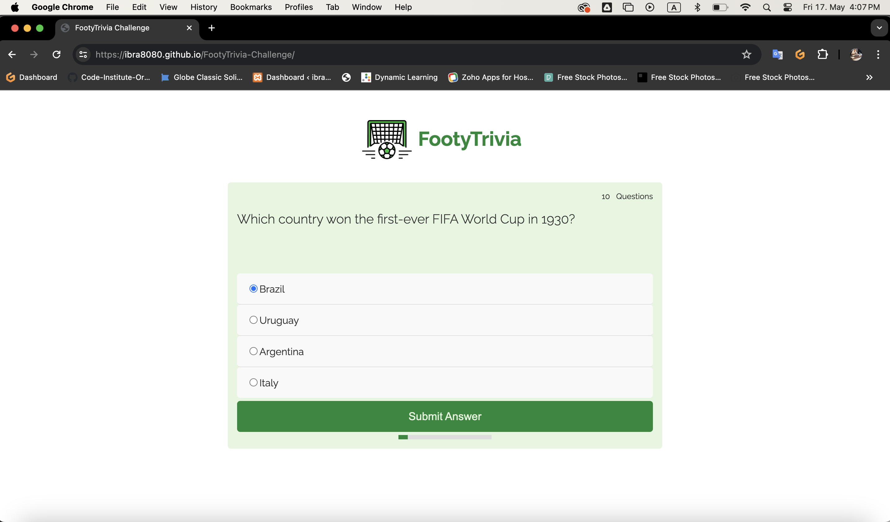 | Works as expected |
| Firefox | 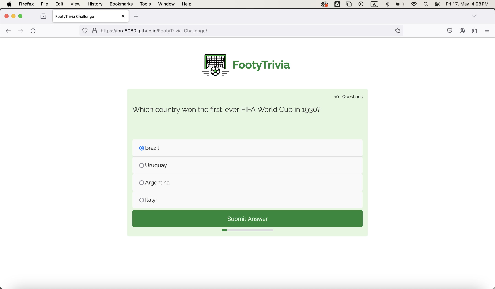 | Works as expected |
| Opera | 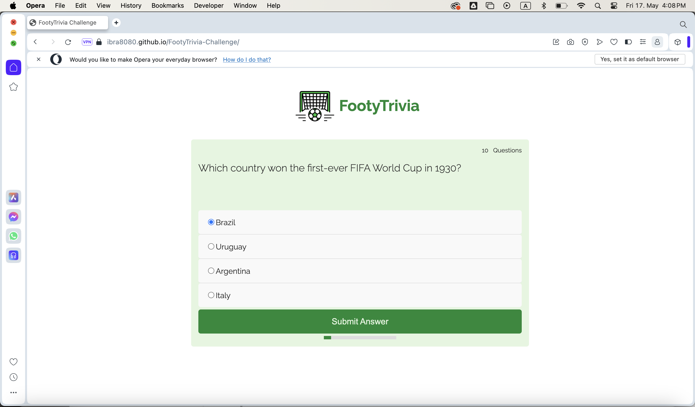 | Works as expected |
| Safari | 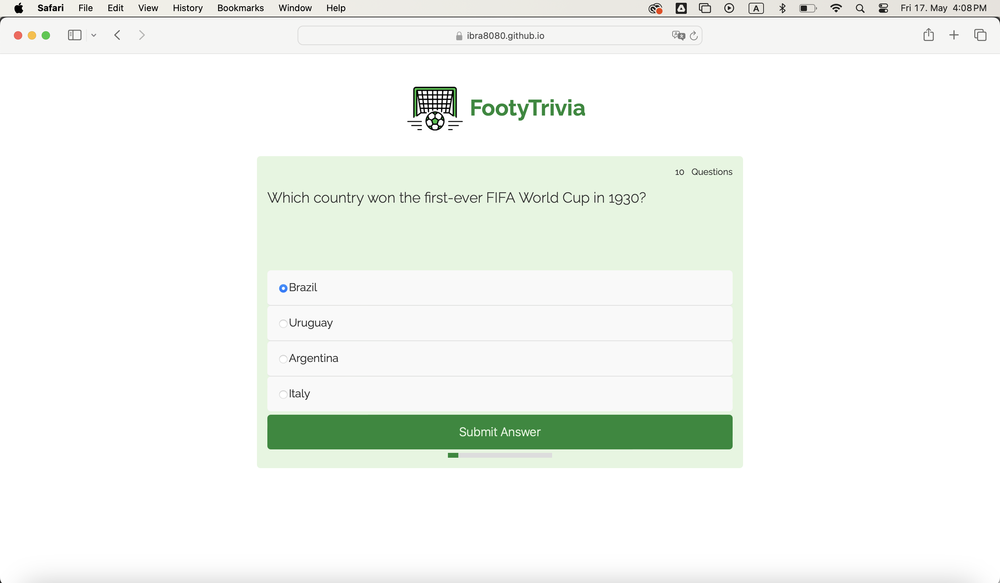 | Works as expected |

## Responsiveness

I've tested my deployed project on multiple devices to check for responsiveness issues.

| Device | Home | results | Notes |
| --- | --- | --- | --- |
| Mobile (DevTools) | 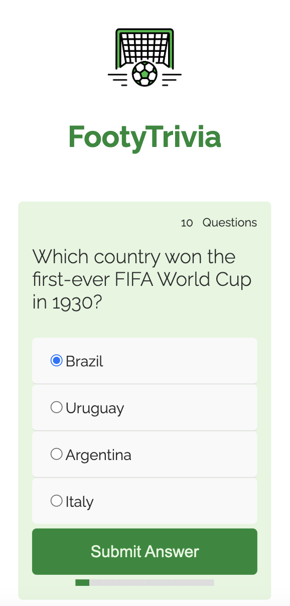 | 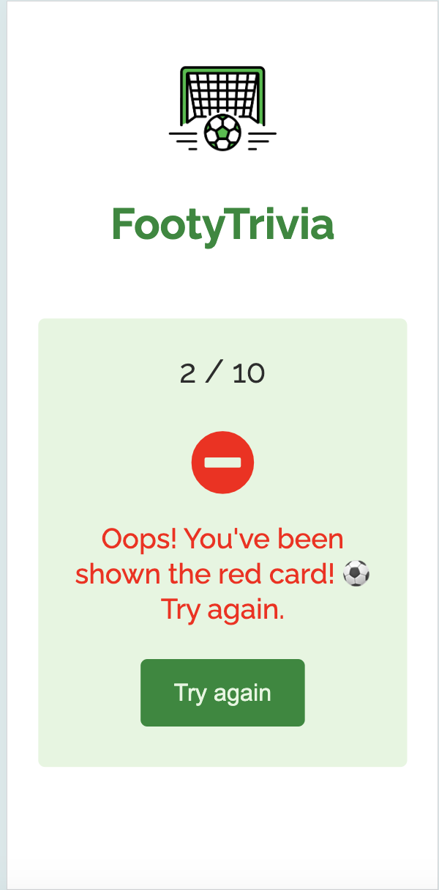 | Works as expected |
| Tablet (DevTools) | 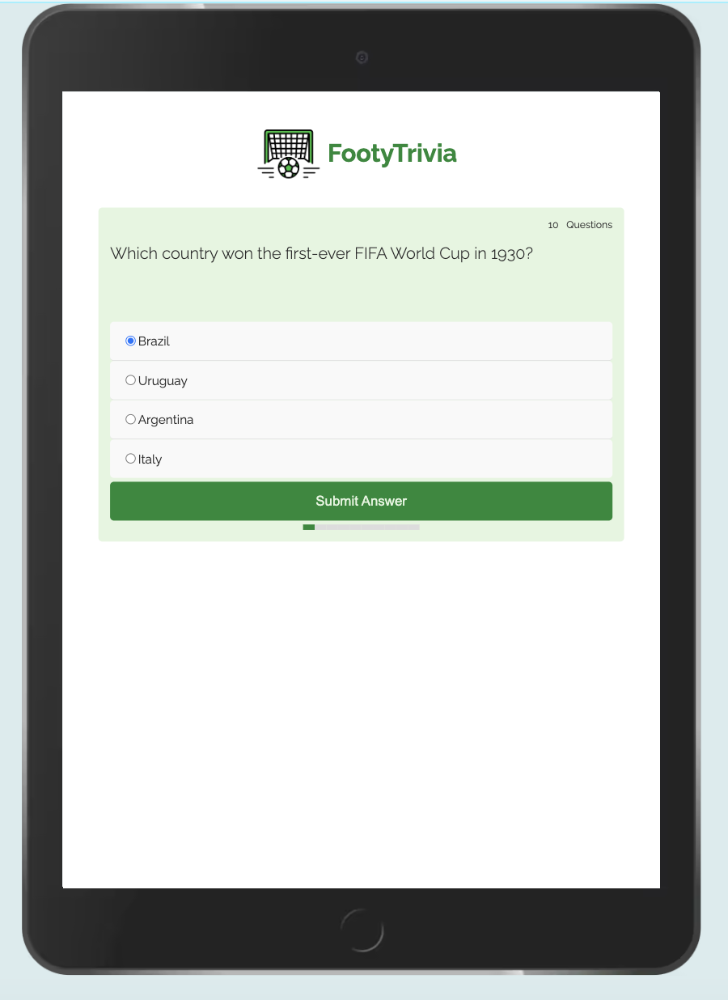 |  | Works as expected |
| Desktop | 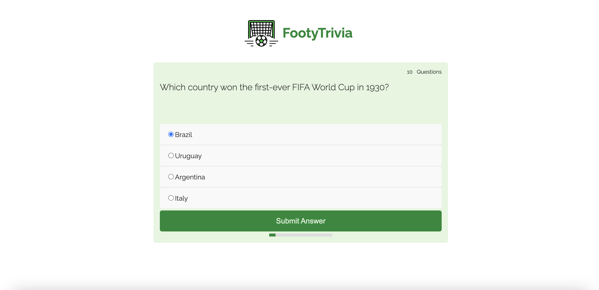 | 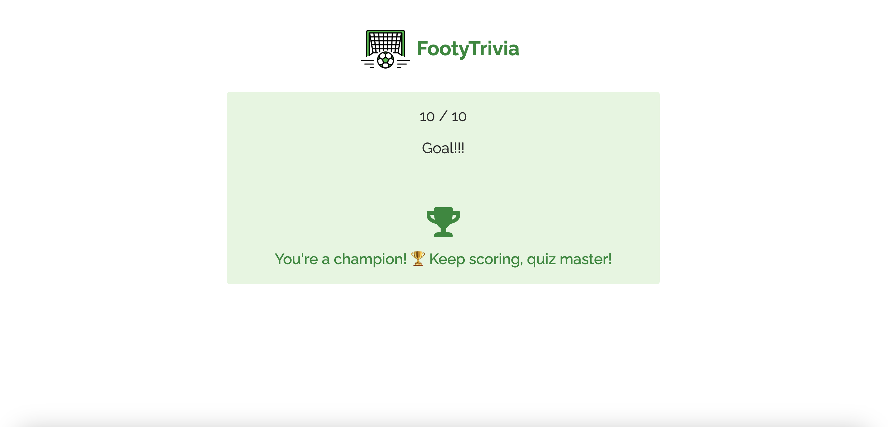 | Works as expected |

## Lighthouse Audit

I've tested my deployed project using the Lighthouse Audit tool to check for any major issues.

| Page | Mobile | Desktop | Notes |
| --- | --- | --- | --- |
| Home | 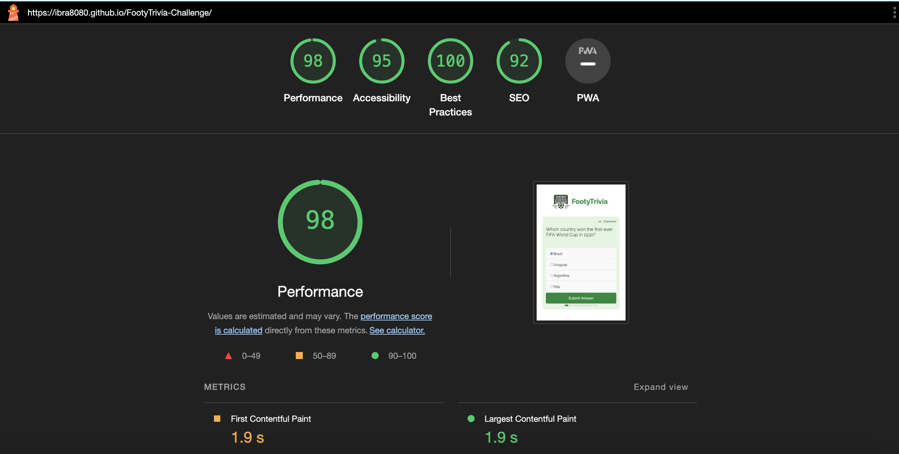 | 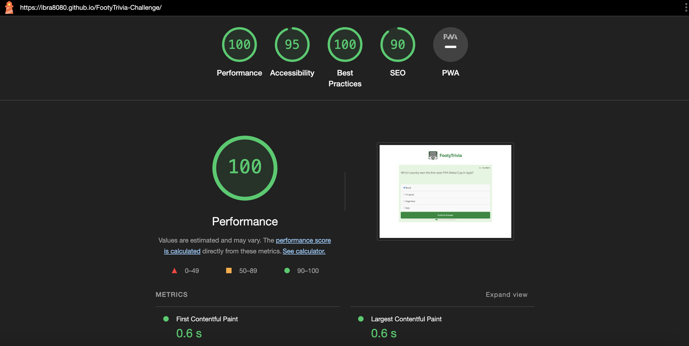 | Some minor warnings |

## Bugs

> [!NOTE]  
> There are no remaining bugs that I am aware of.
